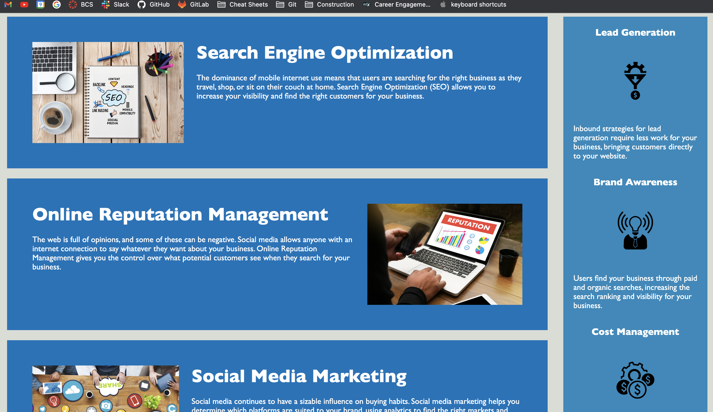

# H1 Horiseon Accessability refactor
this project is a semantic and accessability refactor of a home page for a Search Engine Optimization website. primary coding focus is on editing the existing webpage to use semantic html tags throughout. 
secondary focus on CSS semanitics. CSS code has been cleaned up with comments explaining each selector and its properties. additional minor debugging of anchor elements also occured.

the live site can be accessed here: [Horiseon refactor]( https://rstamey.github.io/semantic-refactor/)

screenshot of live site: 
